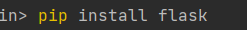
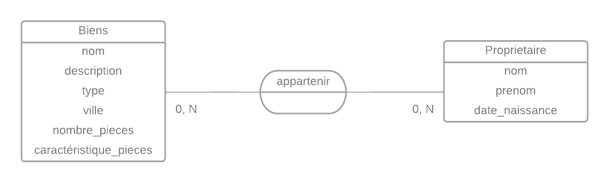
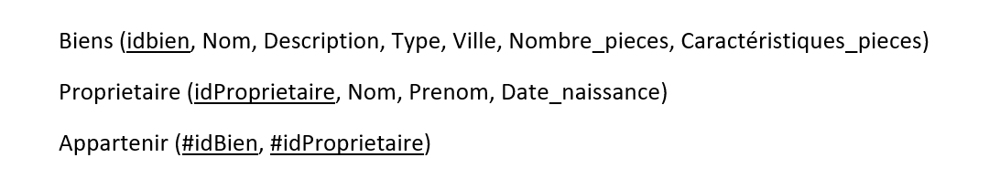

<<<<<<< HEAD
# arcane
test for arcane
# Installation de l'environnement de travail flask
Créer un repertoire 
=======
# Arcane
## Préparation de l'environnement de travail
### Environnement
<ol> 
  <li> Création du dossier pour le projet : mkdir  <i> nom du dossier </i> </li>
  <li> Accéder au dossier : cd  <i> nom du dossier </i> </li>
</ol>

### Installation des paquets 
<ul> 
  <li> Installation du framework Flask : <b> pip install flask </b> </li>  
  
  
  
  <li> Installation de MySQL pour la gestion de la base de données : <b> pip install flask-mysql </b> </li>  
  
   
  
  <li> Installation CORS pour le partage des ressources entre les domaines : <b> pip install cors </b> </li>
  
   
  
</ul>

### Conception 
<b> Modèle Conceptuel de données </b>

<section> 
  <ul><b> Notes :  </b>
    <li> Un proprietaire peut posséder 1 ou plusieurs biens immobiliers </li>
    <li> Un bien immobilier peut appartenir à aucun, un ou plusieurs proprétaires </li>
  </ul>
</section>

<b> Modèle Logique de données </b>

<b> Diagramme de classe </b>
*****
>>>>>>> 2ba5dfc (Update README.md)
